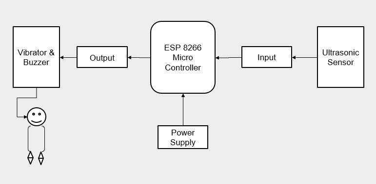
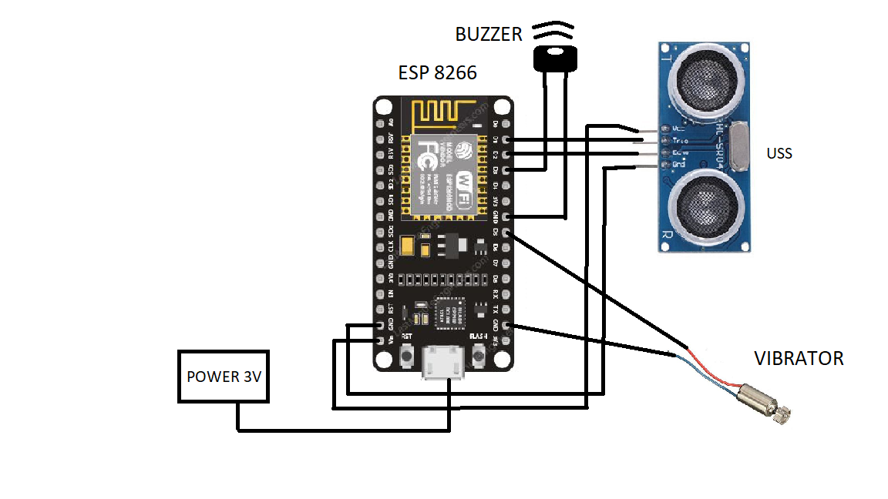
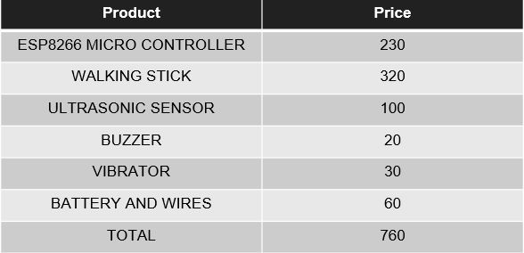

# Smart Walking Stick For Visually Impaired Persons

This repository contains the code and documentation for the Smart Walking Stick project, designed to enhance the mobility and safety of visually impaired individuals. The walking stick utilizes an ESP8266 microcontroller and is equipped with ultrasonic sensors for obstacle detection, providing haptic and auditory feedback to the user.

## Table of Contents
- [Installation](#installation)
- [Usage](#usage)
- [Sample Images](#sample-images)
- [Contributing](#contributing)
- [Authors](#authors)


### Prerequisites

- ESP8266 Microcontroller
- Ultrasonic Sensors
- Vibration Motors
- Buzzer

## Installation

To set up the Smart Walking Stick, follow these steps:

1. Clone the repository to your local machine:
     ```bash
   git clone https://github.com/your-username/smart-walking-stick.git
2. Ensure you have all the necessary hardware components as listed in the project report.
3. Install the required software tools, including Thonny IDE and MicroPython firmware for ESP8266.

## Usage

### Flashing MicroPython onto ESP8266

1. Download the latest MicroPython firmware for ESP8266 from the [MicroPython website](https://micropython.org/download/esp8266/).
2. Use the esptool.py to flash the firmware onto your ESP8266:
   ```
   esptool.py --port /dev/ttyUSB0 erase_flash
   esptool.py --port /dev/ttyUSB0 --baud 460800 write_flash --flash_size=detect 0 
   esp8266-xxxxxx.bin
3. Connect the ESP8266 to your computer and open Thonny IDE.
4. Configure Thonny to connect to the correct port for the ESP8266.

### Flashing the Code

1. Open the code from the repository in Thonny IDE.
2. Press the 'Run' button to upload the code to the ESP8266.
3. The walking stick is now ready to use.

## Methodology

### Algorithm

The Smart Walking Stick utilizes a series of programmed instructions to ensure effective operation. Below is the pseudocode that outlines the core functionality of the device:

1. **Import Required Modules**
   - Import all necessary libraries and modules needed for the operation of the sensors and actuators.

2. **Define Pin Assignments**
   - Assign GPIO pins for the ultrasonic sensor, buzzer, and vibrator to establish control through the microcontroller.

3. **Initialize Components**
   - Initialize the ultrasonic sensor and set initial frequencies for the buzzer and vibrator to ensure they are ready for operation.

4. **Function Definitions**
   - **Distance Measurement Function**: Define a function to measure the distance to obstacles using the ultrasonic sensor.
   - **Buzzer Control Function**: Define a function to control the buzzer sound based on the distance to the nearest obstacle.
   - **Vibrator Control Function**: Define a function to activate the vibrator based on the distance to obstacles, providing tactile feedback.

5. **Main Loop**
   - Continuously measure the distance to obstacles using the ultrasonic sensor.
   - Control the buzzer sound based on the measured distance, with different tones or patterns indicating different distance ranges.
   - Activate the vibrator based on the distance, providing immediate tactile feedback to the user.
   - Include a short delay between consecutive distance measurements to allow for processing and response to changes in the environment.

This algorithm ensures that the Smart Walking Stick provides real-time feedback to the user, enhancing navigation and safety for visually impaired individuals.

## Architecture




## Pin Diagram




## Overall Cost of Product




## Sample Images

Please refer to the `sample_images` directory for visual references and diagrams related to the Smart Walking Stick.

## Contributing

If you would like to contribute to this project, please fork the repository and submit a pull request with your proposed changes. Ensure you update the documentation accordingly.

## Authors

- Deepak AV (MEA20CS025)
- Marwan Pookattil Abdul Kabeer (MEA20CS046)
- Faslu Rahman TP (MEA20CS030)
